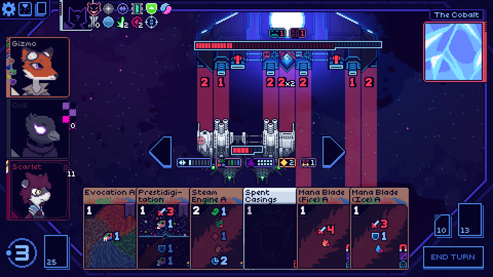
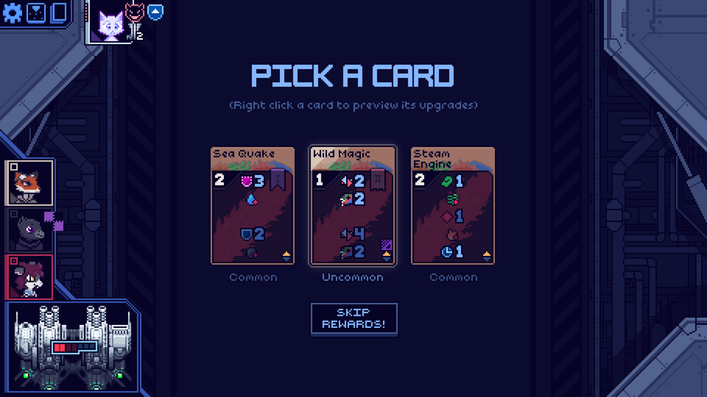

<!--
This README was made using Louis3797's awesome-readme-template
-->

  <h1>Gizmo the Fox Mod</h1>
  
  

    An artificer from a distant realm. His cards allow <c=boldPink>attunement</c> of the four elements to brew <c=boldPink>potions</c> and perform other effects.
  

<!-- Features -->
# Summary

This mod adds the following:

- <b>1</b> Character
- <b>???</b> Cards
  - <b>10/10</b> common
  - <b>8/8</b> uncommon
  - <b>6/6</b> rare
  - <b>???</b> potions
  - <b>10/10</b> generated cards
  - <b>1/1</b> status
  - <b>0/2</b> EXE cards
- <b>???</b> Artifacts
  - <b>???</b> common
  - <b>???</b> boss
- <b>1/1</b> Statuses

# Content Infographics

# Screenshots

